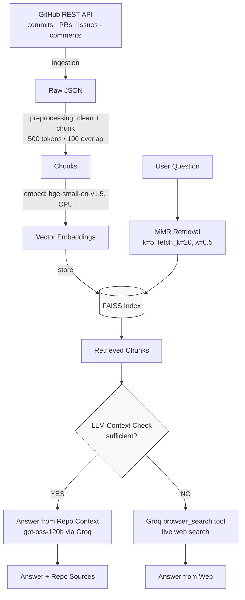

# PatchContext

[](https://patchcontext.streamlit.app/)

A Retrieval-Augmented Generation system that answers design and implementation questions about a GitHub repository, grounded in its own commits, pull requests, issues, and discussion comments — with a web search fallback for questions the repository's history can't answer.

Currently indexed: the [FastAPI](https://github.com/fastapi/fastapi) repository.

The core idea: asking an LLM directly "how does dependency injection work in FastAPI" gets a plausible-sounding answer that may not reflect how *this specific codebase* implements it, or *why* a design decision was made. PatchContext retrieves the actual commits, PRs, and issue threads where that was discussed, and answers from that evidence — but not every question is answerable from repo history alone (e.g. "what's the latest FastAPI version?"). For those, it falls back to a live web search instead of forcing an answer out of context that doesn't contain it.

---

## Architecture



## How it works

**1. Ingestion** (`ingestion/`)
Commits, pull requests, issues, and PR/issue comments are pulled from the GitHub REST API, paginated with retry and backoff. `DEVELOPMENT_MODE` currently caps this to the first 20 PRs and 20 issues, so the index reflects a partial slice of FastAPI's history rather than the full repo.

**2. Preprocessing** (`preprocessing/`)
Each source type is normalized into a common document format, empty/short/duplicate/dependency-bump noise is filtered out, and documents are split into overlapping chunks (500 tokens, 100 overlap), keeping source metadata (type, number, URL) attached to each chunk.

**3. Embedding + Indexing** (`vectorstore/`)
Chunks are embedded locally on CPU with `BAAI/bge-small-en-v1.5` and written to a FAISS index.

**4. Retrieval** (`retrieval/retriever.py`)
Questions are matched against the index using MMR search (`k=5, fetch_k=20, λ=0.5`) to balance relevance with diversity, so the retrieved set isn't five near-duplicate chunks about the same PR. Retrieved chunks are deduplicated and formatted into a structured context block, truncated to 1500 characters per document.

**5. Context sufficiency check** (`chains/rag_chain.py`)
Before generating an answer, a separate LLM call (`check_context`, using `CONTEXT_CHECK_PROMPT`) judges whether the retrieved repo context is actually sufficient to answer the question — this is an LLM judgment call, not a similarity-score threshold.

**6a. Answer from repo context** — if sufficient
The retrieved context and question are passed to `gpt-oss-120b` (served via Groq, `temperature=0`) through `RAG_PROMPT`, and the answer is returned with `source_type: "context"` alongside the specific PRs/issues/commits/comments it drew from, each with a label and GitHub URL.

**6b. Web search fallback** — if not sufficient
The question is passed to `utils/web_search.py`, which calls Groq's hosted `browser_search` tool (via the OpenAI-compatible Responses API, `tool_choice="required"`) to search the live web and generate an answer directly, returned with `source_type: "web"`.

**7. UI** (`app.py`)
A Streamlit interface shows which path answered the question (repo context, web, or both), the answer, and the sources — repo sources link back to the originating commit/PR/issue; a section for individual web source links exists in the UI but isn't populated yet by the current chain (`web_sources` is always returned empty).

## Tech Stack

| Layer | Choice |
|---|---|
| Orchestration | LangChain |
| LLM (answer generation) | `openai/gpt-oss-120b` via Groq |
| Web search fallback | Groq's `browser_search` tool (OpenAI-compatible Responses API) |
| Embeddings | HuggingFace `BAAI/bge-small-en-v1.5` (local, CPU) |
| Vector store | FAISS |
| Retrieval strategy | MMR (k=5, fetch_k=20, λ=0.5) |
| Data source | GitHub REST API (commits, PRs, issues, comments) |
| UI | Streamlit |

## Project Structure

```
├── ingestion/       # GitHub API client + fetch scripts (commits, PRs, issues, comments)
├── preprocessing/   # Normalize, clean, and chunk raw data into embeddable documents
├── vectorstore/     # FAISS index build / load / save
├── retrieval/        # MMR retriever + context formatting
├── chains/            # rag_chain.py: context check → answer or web fallback
├── models/             # LLM and embedding model factories
├── prompts/             # RAG prompt + context-check prompt templates
├── utils/                # web_search.py (Groq browser_search), logger
├── guardrails/            # Input/output checks on the chain
├── evaluation/             # Pipeline evaluation
├── config/                  # Central settings: models, chunking, paths, retrieval params
└── app.py                    # Streamlit UI
```

## Example Questions

- How does dependency injection work? *(answered from repo context)*
- Which PR added lifespan support? *(answered from repo context)*
- What is the latest FastAPI version? *(answered via web fallback)*

## Running Locally

```bash
git clone https://github.com/Sumit-Todwal/PatchContext.git
cd PatchContext
pip install -r requirements.txt
```

Set `GITHUB_TOKEN` and `GROQ_API_KEY` in a `.env` file, then run the ingestion pipeline once (`ingestion/` → `preprocessing/` → `vectorstore/`) to build the FAISS index, and start the app:

```bash
streamlit run app.py
```

## Known Limitations

- The context-sufficiency check is a single LLM judgment call, not a calibrated threshold — it can be wrong in either direction (falling back when repo context would have sufficed, or vice versa).
- The web fallback answers from Groq's browser search directly; it doesn't currently return individual cited web source links, even though the UI has a section built for them.
- The FAISS index is built from a capped subset of PRs/issues (`DEVELOPMENT_MODE`), not the full repository history.

---

Originated as a data science internship project at Celebal Technologies.
